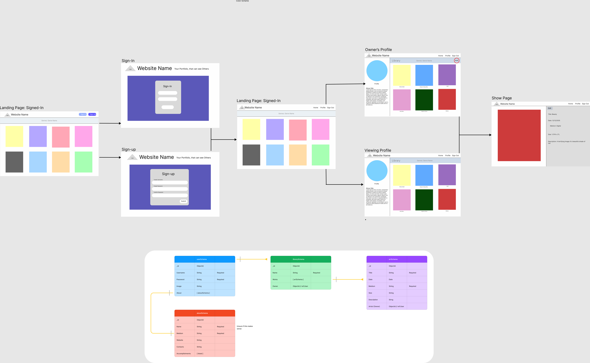

# PROJECT DETAILS

Name: Artfolio
Languages: HTML, CSS, EJS and JS

## USER STORIES

AAU I want to be view others artworks before I need to Sign-in/up. See what the community is like and be able to explore certain genres.

AAU I want a simple Sign-in/up page that is easy to understand.

AAU I want to have ease of navigating from home and profile page. The ability to sign out at any time.

AAU I want to personalize my profile with information that shows who I am as an artist. I want it to contain information about my name and medium.

AAU I want to be able to have a library with my artworks in them. The library should show a picture of the work, title and artist. I should be able to add and delete the amount of works in the library.

AAU I want to be able to click the works and view its information. If I am the owner, I want the option to edit or delete the piece.

## MVP

1. Users should have a profile account in which they can show others their artworks.
   1. They should be able to edit an About Me to help network and share their works. The About Me should show their contacts, website, biography and real name.
1. Users Profile will show a list of their artworks.
   1. Users can click any artwork to view its information (title, date, description, size, medium and genre).
   1. Within the artworks Show page, they will display an edit and delete button if they are the user
1. Main page will display artworks from multiple Users.
1. They will have the ability to create an account(sign-up) and sign-in.

## CONCEPTS

## STRETCH GOALS
